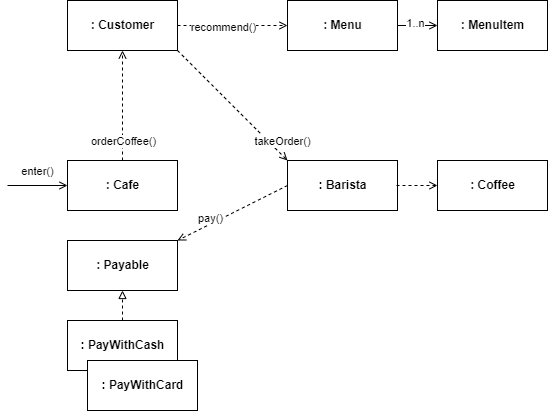

<div align="center">

# Object Oriented Cafe

</div>

> **NOTE:**
>
> 본 과정은 [Google Developer Student Club Sookmyung. 객체지향과 스프링에 대한 이해](https://youtu.be/uzch3bilTvo?si=_L1W4I8crdjxzJj1) 영상의 내용을 기반합니다.

- [Object Oriented Cafe](#object-oriented-cafe)
  - [개선과정](#개선과정)
    - [1단계: 절차지향적 설계](#1단계-절차지향적-설계)
    - [2단계: 객체의 행동](#2단계-객체의-행동)
    - [3단계: 유연한 변경](#3단계-유연한-변경)

## 개선과정

### 1단계: 절차지향적 설계

클래스를 정하고 어떤 데이터가 필요한지부터 채웁니다.

```ts
export default class Cafe {
  ...

  enter(customer: Customer): void {
    const selectedMenuItem: MenuItem = customer.selectRandomMenuItem(
      this._menu
    );

    customer.money = customer.money - selectedMenuItem.price;
    this._barista.amount = this._barista.amount + selectedMenuItem.price;

    const coffee: Coffee = this._barista.makeCoffee(selectedMenuItem);
    customer.coffee = coffee;
  }
}
```

> **WARNING: 맥락이 부자연스럽습니다.**
>
> - Cafe가 손님의 돈을 바리스타에게 넘겨줍니다.
> - Cafe가 바리스타에게 커피를 만들라고 시킵니다.
> - Cafe가 손님한테 커피를 줍니다.

### 2단계: 객체의 행동

- Customer는 결제를 합니다.
- Barista는 돈 받기를 합니다.
- Menu는 MenuItem을 랜덤 선택 합니다.
- Customer는 커피를 요청 합니다.

```ts
export default class Cafe {
  ...

  enter(customer: Customer): void {
    const selectedMenuItem: MenuItem = this._menu.recommend();

    customer.pay(selectedMenuItem.price);
    this._barista.receive(selectedMenuItem.price);

    customer.orderCoffee(this._barista, selectedMenuItem);
  }
}
```

> **WARNING: 맥락이 부자연스럽습니다.**
>
> - Customer가 아닌, Cafe가 Menu를 랜덤 선택 합니다.
> - Customer의 결제 행동과 Barista의 돈 받기 행동은 상호작용이 있지만, 서로 독립적입니다.

<br/>

- Customer가 Menu를 랜덤 선택 합니다.
- Customer의 주문 행동에 Menu 랜덤 선택 행동과 결제-돈 받기 행동을 포함 합니다.

```ts
export default class Cafe {
  ...

  enter(customer: Customer): void {
    customer.orderCoffee(this._barista, this._menu);
  }
}
```

```ts
export default class Customer {
  ...

  orderCoffee(barista: Barista, menuItem: MenuItem): void {
    const menuItem: MenuItem = menu.recommend();

    this.pay(menuItem.price);
    barista.receive(menuItem.price);

    const coffee: Coffee = barista.makeCoffee(menuItem);
    this._coffee = coffee;
  }
}
```

> **WARNING: 맥락이 부자연스럽습니다.**
>
> - Customer의 주문 행동에 주문을 받는 행동 없이 결제 흐름으로 이어집니다.

<br/>

- Customer의 주문에 Barista가 주문을 받습니다.

```ts
export default class Customer {
  ...

  orderCoffee(barista: Barista, menu: Menu): void {
    const menuItem: MenuItem = menu.recommend();

    const coffee: Coffee = barista.takeOrder(menuItem, this);
    this._coffee = coffee;
  }
}

export default class Barista {
  ...

  takeOrder(menuItem: MenuItem, customer: Customer): Coffee {
    customer.pay(menuItem.price);
    this.receive(menuItem.price);

    return this.makeCoffee(menuItem);
  }
}
```

### 3단계: 유연한 변경

행동을 정하고 어떤 데이터가 필요한지부터 채웁니다.

**결제 방법 변경**


