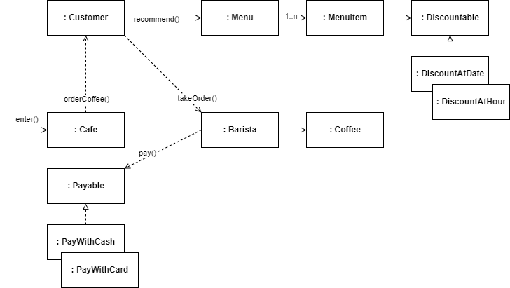

# Object Oriented Cafe

> **NOTE:**
>
> 본 과정은 [Google Developer Student Club Sookmyung. 객체지향과 스프링에 대한 이해](https://youtu.be/uzch3bilTvo?si=_L1W4I8crdjxzJj1) 영상의 내용을 기반합니다.

- [Object Oriented Cafe](#object-oriented-cafe)
  - [개선과정](#개선과정)
    - [1단계: 절차지향적 설계](#1단계-절차지향적-설계)
    - [2단계: 객체의 행동](#2단계-객체의-행동)
    - [3단계: 유연한 변경](#3단계-유연한-변경)

## 개선과정

### 1단계: 절차지향적 설계

클래스를 정하고 어떤 데이터가 필요한지부터 채웁니다.

> **WARNING: 행동 주체가 부자연스럽습니다.**
>
> - Cafe가 Customer에게 MenuItem을 랜덤 선택 시킵니다.
> - Cafe가 Customer와 Barista의 돈을 계산합니다.
> - Cafe가 Barista에게 주문을 시킵니다.

### 2단계: 객체의 행동

- Customer는 결제 행동을 합니다.
- Barista는 돈 받기 행동을 합니다.
- Menu는 MenuItem의 랜덤 선택 행동을 합니다.
- Customer가 Barista에게 주문 행동을 시킵니다.

> **WARNING: 행동 주체가 부자연스럽습니다.**
>
> - Cafe가 Menu에게 MenuItem의 랜덤 선택 행동을 시킵니다.
> - Cafe가 Customer의 결제 행동과 Barista의 돈 받기 행동을 시킵니다.

 

- Customer가 Menu에게 MenuItem의 랜덤 선택 행동을 시킵니다.
- Customer가 결제 행동의 주체가 됩니다.
- Barista가 돈 받기 행동의 주체가 됩니다.

> **WARNING: 양방향 관계가 성립합니다.**

### 3단계: 유연한 변경

행동을 정하고 어떤 데이터가 필요한지부터 채웁니다.

**결제 방법 변경**

**할인 방법 추가**

- 출근 시간대 (8-10시)에 전 메뉴를 500원 할인합니다.
- 매달 20일에 아메리카노 메뉴를 20% 할인합니다.

